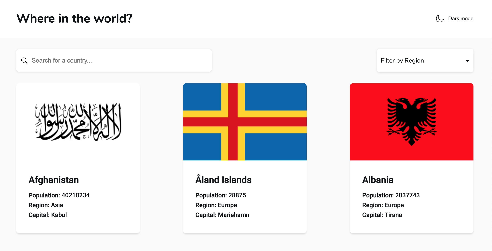
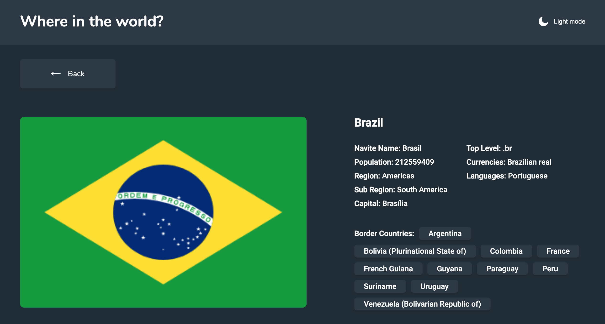

# Country Information

This project is a web application built with React, JavaScript, Sass, and HTML. The challenge was to create an application that pulls country data from a data.json file and displays it based on provided designs. The application allows users to explore countries, search for specific ones, filter by region, and view detailed information about each country.

## Features

- Homepage: Displays a list of all countries retrieved from the data.json file.
- Search: Users can search for a specific country using an input field, making it easy to find information quickly.
- Filter by Region: The application provides the ability to filter countries by region, enhancing user experience.
- Detailed Information: Clicking on a country reveals more detailed information on a separate page, offering additional insights.
- Border Countries: Users can click through to view information about the border countries of a selected country.
- Responsive Design: The interface adapts to different screen sizes, ensuring optimal user experience across devices.

## Bonus Feature

- Color Scheme Toggle: Users have the option to toggle between light and dark mode, providing a personalized visual experience.

## Deployment

Deployed with Github Pages.

_Link:_ https://fercfmsouza.github.io/countries-info/

## Example Image

Here's some images of the application in action:

